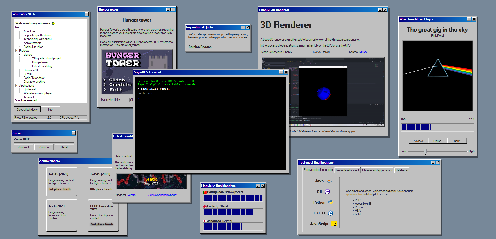

# My portfolio!

An interactive site made to display my projects inspired by the 1990 Cern WorldWideWeb and the Windows 98 operating system!  
Have fun browsing my stuff with some extras like a terminal and a music player for amusement ;).

[https://sagiri721.github.io/Portfolio/](https://sagiri721.github.io/Portfolio/)
